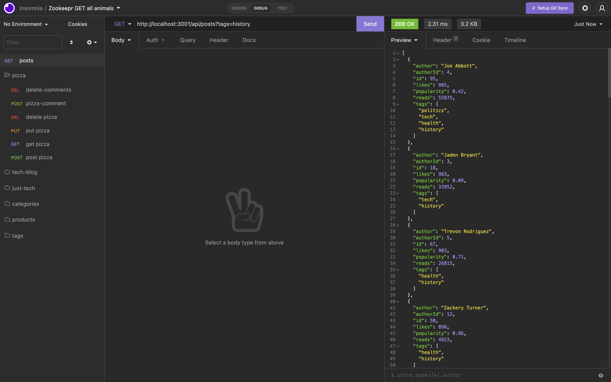
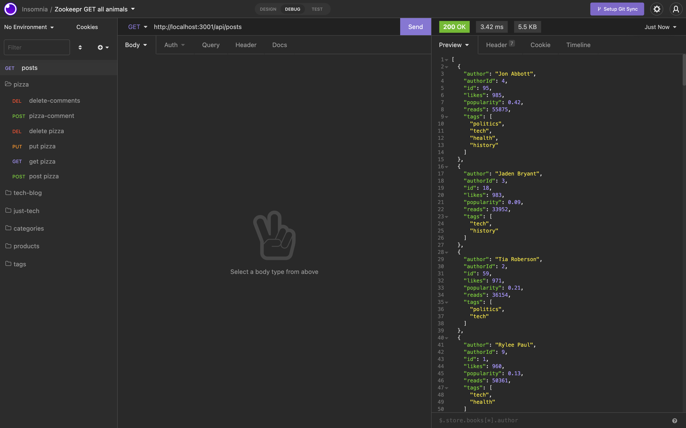

# blog-posts_assessment

## Purpose
Create a backend api to display blog posts

## Built With
* Node
* Express

## Navigation
* npm init
* npm i express
* node server.js

## Preview

## GitHub
https://github.com/EliP2389/blog-posts_assessment.git